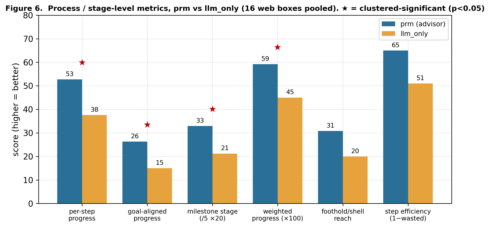
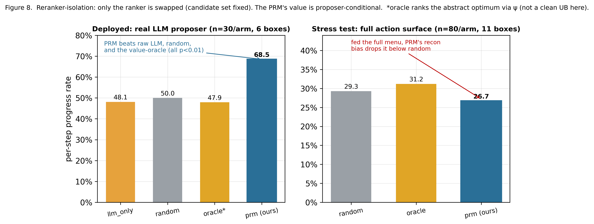
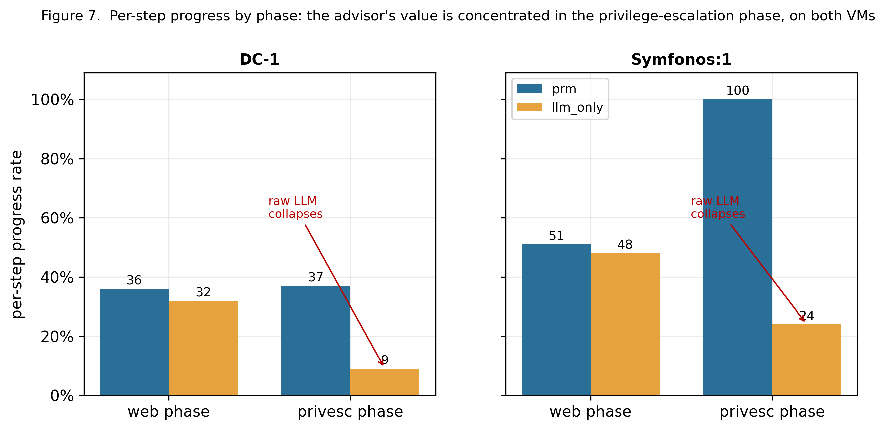

# Experiments

## E.1 Overview and research questions

We study a cheap **advisor** that re-ranks the next-action candidates an LLM proposes during an autonomous web attack. The advisor is a **process reward model (PRM)** that scores the quality of each *step* rather than the final outcome, trained entirely inside an abstract single-host simulator, with no labels from any real target and no access to hidden task state. We ask whether that simulator-trained scorer gives useful advice on real machines.

The advisor is a **proposer-conditional reranker**: it improves per-step decision quality once a real LLM proposer has narrowed the candidate set to a few plausible actions, and degrades below random when forced to rank the full action surface. We fix this scope before the headline numbers, so that the deployment result (RQ2) and the stress-test reversal (RQ2, §E.4.2) read as one model on two input distributions. The advisor ranks moves a player is already considering; it does not play. It was trained only in a simplified trainer, never on a real target, so the question is whether its judgment transfers.

| RQ | Question | § |
|---|---|---|
| **RQ1** | Does a process evaluator trained only in the abstract simulator capture genuine step quality, leak-free? | E.3 |
| **RQ2** | Does that label-free evaluator transfer to real targets and improve the per-step process, and under what input conditions? | E.4 |
| **RQ3** | Can the transferred process reward drive complete real kill chains to root, and where does its value concentrate? | E.5 |
| **RQ4** | Does the result hold across LLM vendors? | E.7 |

§E.6 reports the one structural limitation, recon over-valuation.

## E.2 Setup

**Simulator.** We model single-host web attacks as an abstract MDP with a **frozen menu of 16 action types** (enumerate paths, check a vulnerability, run a command, escalate privileges, and so on). We generated **65 attack tasks** spanning **12 attack-chain shapes**, holding out **20 tasks for testing**, of which **10 use chain shapes never seen in training**. Inside the simulator we train, in order, a reinforcement-learning **value oracle** (how close a state is to the goal), which **labels** candidate-action quality, which in turn trains the **PRM**. The PRM is only ever shown observable information; it never sees the oracle's internal scores or hidden task state.

**Adapter.** Three translators bridge simulator and real target, plus a safety gate: a **reader** maps raw tool output to the simulator state format; an **interpreter** (ψ) maps the LLM's free-text action onto one of the 16 action types; an **executor** turns a chosen action type into a concrete command; a **safety gate** allow-lists and logs every command. All targets are owned, run on an isolated host-only network, allow-listed, and logged.

**Action-coverage audit.** Each of the 19 real targets (16 Docker boxes, 3 VMs) reached its observed success or failure within the frozen 16-action schema; no target required an out-of-schema action.

**Targets.** **16 Docker web boxes** (each a single web service with a known vulnerability) give breadth; **3 full VMs** (DC-1, Symfonos:1, Toppo) give depth: the complete chain web entry → foothold → same-machine privilege escalation → root (Table 1).

**Table 1 — Real targets: 16 Docker web boxes (foothold only), grouped by foothold mechanism, plus 3 full VMs.**

| Foothold mechanism | n | Docker boxes (product / CVE) |
|---|---|---|
| Direct RCE | 9 | ThinkPHP-5, ThinkPHP-5.0.23, Struts2 S2-045, Struts2 S2-048, php-cgi (CVE-2012-1823), Drupalgeddon2 (CVE-2018-7600), Apache httpd (CVE-2021-41773), Tomcat (CVE-2017-12615), Gitea 1.4 |
| Weak-credential → deploy/RCE | 2 | Tomcat8 (manager), WebLogic |
| SQL injection | 1 | Joomla (CVE-2017-8917) |
| Template injection (SSTI) | 1 | Flask / Jinja2 |
| File disclosure / LFI | 2 | Rails (CVE-2019-5418), php-inclusion |
| Misconfiguration / traversal | 1 | nginx (insecure config) |

| Full VM (whole-machine, → root) | chain | terminal metric |
|---|---|---|
| **DC-1** | Drupalgeddon2 (CVE-2018-7600) → SUID `find` | `reached_root` |
| **Symfonos:1** | mail-masta LFI (CVE-2016-10956) + SMTP poisoning → SUID `/opt/statuscheck` PATH-hijack | `reached_root` |
| **Toppo** | creds in `/admin/notes.txt` → SSH → SUID `python` | `reached_root` |

The 16 boxes span ~12 products and 6 foothold-mechanism classes; direct RCE dominates (9/16), reflecting the Vulhub corpus. This is breadth of product, not of vulnerability class. The frozen 16-action schema abstracts the kill-chain steps (recon → locate → exploit → shell → read/escalate), not the vulnerability class, so the per-box diversity the PRM sees comes from chain length and topology, not CVE family.

**RQ → dataset allocation.**

| RQ | Evaluation set | Size |
|---|---|---|
| RQ1 | Stage-1 held-out tasks | 20 tasks (10 unseen-chain), 5 seeds |
| RQ2 | 16 Docker boxes, DeepSeek A/B | 5 trials/arm, 80 runs/arm; reranker-isolation deployed n=30/arm (6 boxes), stress n=80/arm (11 boxes) |
| RQ3 | 3 full VMs | DC-1 n=18, Symfonos:1 n=10, Toppo n=1 |
| RQ4 | 7 targets × 3 vendors | DeepSeek / Qwen-3.7-max / GPT-5.4 |

**Comparison and metrics.** Every real-target result pairs two agents that share the **same LLM** and differ only in the advisor: `prm` (LLM proposes, advisor re-ranks) vs `llm_only` (LLM's own ordering). `llm_only` is the primary baseline. Two reference rankers sharpen specific claims: a **random-rerank** control (re-orders the same candidates randomly) and the **RL value-oracle** (the non-LLM teacher the PRM was distilled from). Because the advisor is a process reward model, the primary metrics are process- and stage-level — per-step progress (↑), kill-chain stage reached and shell-reach (↑), per-decision ranking accuracy vs oracle (↑), wasted-step rate (↓). Goal-rate / root-rate (↑) is reported as the downstream outcome check.

**Statistics.** A run is a sequence of correlated steps, so the clustering unit is the **target**: 16 boxes × 5 trials per arm, with episodes clustered within target. Significance comes from an **episode-clustered permutation test** (permute the arm label within each target cluster, recompute the pooled statistic, 10⁴ permutations), with **bootstrap confidence intervals** (resample clusters) and **common-random-numbers** pairing of the two arms on identical situations. Where a family of hypotheses is tested we apply **Holm correction** and report the corrected value. The RQ2 process family is 4 metrics; the headline per-step gain (+15.1pp, raw p=0.0012) remains significant after Holm correction over that family.

The A/B compares `prm` against `llm_only` with a **shared proposer**, so it measures the **joint proposer+PRM** effect on per-step quality, not transfer efficiency in isolation. Isolating transfer efficiency from the proposer's own contribution would require an oracle-trained or zero-label-baseline PRM ranking the same candidates, which we do not run. Deployment **gain** is established below; transfer **efficiency** remains open.

## E.3 RQ1 — A faithful, leak-free Stage-1 process evaluator

The simulator teaches a coarse but real sense of which action makes progress, and the audit finds no leakage.

**(a) The oracle ranks progress correctly.** Against a value-iteration optimal solver of the simulator, the oracle's single best guess matches the optimum **32%** of the time, the optimum sits in its **top 3 94%** of the time, and its overall ordering correlates with the optimum at **rank-correlation +0.46**. The value keeps good actions near the top, which is what a re-ranker needs.

**(b) The advisor is a good ranker.** On pairwise accuracy (given two actions of known relative quality, how often the advisor orders them correctly; 0.5 is chance), the deployed advisor reaches **0.89 across all held-out tasks** (95% CI [0.84, 0.94], stable over 5 seeds), **0.98 on new instances of trained chains**, and **0.80 on entirely new chain shapes**, its weakest split but still above chance. A preference-loss training variant raises the unseen-chain number to 0.93, undeployed headroom. We report the deployed model's numbers throughout, since it drives every real-target result below.

**(c) No leakage.** The advisor's input contains no secret path, credential, or flag, and masking any single observable field degrades it only gracefully. Its skill comes from observable context.

Driving an agent on its own, the advisor fails as a standalone policy (goal-rate 0.000, n=3, §E.4): it is a ranker, not a player.

**Table 2 — Stage-1 advisor quality (deployed model).** Held-out evaluation; PRM pairwise over 5 seeds.

| Check | Value | Meaning |
|---|---|---|
| Oracle top-1 vs optimal | 0.32 | exact-best match is modest |
| Oracle top-3 vs optimal | 0.94 | the optimum is almost always near the top |
| Oracle rank-correlation | +0.46 | overall ordering tracks the optimum |
| PRM pairwise — all held-out | 0.89 (95% CI [0.84, 0.94]) | ranks the better of two actions correctly |
| PRM pairwise — new instances | 0.98 | generalizes to new instances of trained chains |
| PRM pairwise — new chain shapes | 0.80 | generalizes to unseen structures (weakest split) |
| PRM calibration (ECE, after sigmoid) | ≈ 0.08 | predicted scores are well-calibrated |

*Figure 5. Deployed advisor's pairwise ranking accuracy by split (dashed line = 0.5 chance; CI on the "all held-out" bar; dashed outline marks the 0.93 a non-deployed preference-loss variant reaches on the hardest split).*

*The simulator-trained evaluator ranks the better action 0.89 of the time on held-out tasks (0.80 on unseen chain shapes) with no detectable leakage.*

## E.4 RQ2 — Transfer to real targets, as a proposer-conditional advisor

A label-free simulator-trained reranker transfers to real targets as a **proposer-conditional advisor**: it improves per-step quality when a real LLM proposer pre-narrows the candidate set (+15.1pp pooled, p=0.0012, Holm-significant), and degrades below random when forced to rank the full action surface (stress test, §E.4.2). What transfers is a weak-proposer-rescue reranker, not a general standalone ranker.

The adapter works first: the interpreter ψ maps free-text actions to the correct type **95.5%** of the time on a labeled benchmark and **78.5%** on harder held-out fixtures, up from a **49%** un-enhanced baseline. Across the 16 Docker boxes (DeepSeek, 5 trials/arm, 80 runs/arm), the `prm` agent makes forward progress on **52.7% of its steps vs 37.6% for `llm_only`** (+15.1pp, episode-clustered p=0.0012, Holm-significant). The process family is broad: 4 of 8 process metrics are clustered-significant (per-step, goal-aligned, milestone-stage, weighted progress).

**Table 2a — Process / stage-level metrics (16 web targets, pooled, prm vs llm_only).** Arrows give the good direction; *p* is the episode-clustered permutation test where computed.

| Process / stage metric | prm | llm_only | p |
|---|---|---|---|
| Per-step progress rate ↑ | 52.7% | 37.6% | 0.0012 |
| Goal-aligned (forward-only) progress ↑ | 26.3% | 15.0% | 0.0018 |
| Mean kill-chain stage reached ↑ (0=recon … 5=root) | 1.65 | 1.06 | 0.035 |
| Weighted progress ↑ | 0.59 | 0.45 | 0.026 |
| Foothold / shell-reach rate ↑ | 31% | 20% | 0.11 (n.s.) |
| Wasted-step rate ↓ | 0.35 | 0.49 | — |
| Per-decision top-1 ranking acc ↑ (vs oracle; Qwen+GPT, 14 boxes) | 0.47–0.78 | 0.0–0.41 | — |
| Stage-1 pairwise ranking acc ↑ (held-out) | 0.89 / 0.98 / 0.80 | (0.5 chance) | — |

*Figure 6. Process / stage-level metrics, prm vs llm_only (16 boxes pooled). ★ marks the four clustered-significant metrics. Milestone-stage and weighted progress are rescaled to a common axis (×20, ×100).*

Whole-episode goal-reach is also higher (prm 31% vs llm_only 12%, p=0.005), but this outcome gain is downstream and proposer-conditional. The shell-reach process metric is not significant (31% vs 20%, p=0.11) while the goal rate is (31% vs 12%, p=0.005); the goal gain therefore comes not from a uniform lift in foothold-reach but from a small set of boxes that flip from 0 to solved, quantified next.

### E.4.1 Where the gains concentrate

The goal and per-step gains are not uniform across boxes. We stratify the 16 boxes ex-post by the `llm_only` baseline into **proposer-fail** (raw LLM goal 0 and per-step ≤ 5%), **proposer-weak** (raw LLM makes partial progress, goal often 0), and **proposer-strong/solved** (raw LLM already solves or leads per-step). Per-box numbers are in Table 2b (appendix); n=5 per box is underpowered, so the strata, not single boxes, carry the reading.

**Table 2a-strat — Per-step and goal delta (prm − llm_only) by proposer stratum.**

| Stratum | Boxes | per-step Δ (prm − llm) | goal Δ |
|---|---|---|---|
| Proposer-fail | Flask-SSTI (0→42), Struts2-S2-048, php-cgi, ThinkPHP-5.0.23 | large + (e.g. SSTI +42pp) | + (SSTI 0→100, ThinkPHP-5.0.23 +40) |
| Proposer-weak | Struts2-S2-045, Joomla, Rails, nginx, php-inclusion, httpd | + (mostly) | + or tied |
| Proposer-strong/solved | Drupalgeddon2 (41/100), Tomcat-12615 (19/29), Tomcat8 (44/67), Gitea (24/36), WebLogic (18/21), ThinkPHP-5 (goal 20/80) | − on 6 boxes | tied or − (ThinkPHP-5 llm wins goal) |

The pooled per-step gain is driven by the proposer-fail and proposer-weak strata, where the raw LLM proposes poorly or not at all. On the proposer-strong/solved stratum the advisor loses per-step on **6/16 boxes** (Drupalgeddon2, Tomcat-12615, Tomcat8, Gitea, WebLogic) and loses the goal on ThinkPHP-5 (20% vs 80%): when the LLM already fires the single correct action, extra scouting dilutes the rate. The advisor adds value where the proposer is weak and subtracts it where the proposer is already correct.

### E.4.2 Reranker-isolation ablation

The per-step gain could come from any re-ordering. We hold the candidate set **fixed** and swap only the ranker, across four arms: raw LLM order (`llm_only`), PRM, **random** re-order, and the RL **value-oracle**. We run two settings: *deployed* (a real LLM proposer supplies a small targeted candidate set) and a *stress test* (a deterministic proposer floods the agent with the entire action surface). Both settings use the same fixed-candidate-set machinery; the proposer-fail boxes in §E.4.1 fall into the deployed regime, where the LLM still supplies a short list to rank.

**Table 2d — Reranker-isolation: per-step progress / goal-rate when only the ranker changes (candidate set fixed).**

| Ranker (candidate set fixed) | Deployed — real LLM proposer | Stress — full action surface |
|---|---|---|
| `llm_only` (raw LLM order) | 0.481 / goal 0.23 | — |
| `random` (re-order) | 0.500 / goal 0.33 | 0.293 / goal 0.46 |
| `oracle` (RL value-oracle) | 0.479 / goal 0.27 | 0.312 / goal 0.60 |
| **`prm` (ours)** | **0.685 / goal 0.40** | **0.267 / goal 0.50** |

*Sources: `stage2_ablation_rerank.json` (stress), `stage2_ablation_rerank_llm.json` (deployed); n=30/arm (deployed, 6 boxes), 80/arm (stress, 11 boxes); episode-clustered permutation tests.*

In the deployed setting the PRM's ranking is best at 0.685 per-step. The two clean comparisons are PRM vs `llm_only` (**+20.4pp, p=0.0055**) and PRM vs `random` (**+18.5pp, p=0.0068**): a random re-order does not reproduce the gain, so the PRM's specific ranking carries it.¹ In the stress test, where the proposer dumps the whole action menu, the PRM's recon over-valuation (§E.6) makes it waste steps enumerating, and it sits **below** both random (−2.7pp, p=0.0034) and the oracle (−4.6pp, p<0.001) at 0.267. The oracle's stress value, 0.312, is the cleaner upper-bound reference, and the PRM falls below it there. The PRM's value is proposer-conditional: it pays off when a proposer narrows the field to a few sensible moves, and reverses when it must rank the raw action surface itself.

¹ In the deployed setting the oracle ranks the abstract optimum, which maps imperfectly back through ψ to the LLM's concrete candidate text, so the deployed PRM-vs-oracle comparison (+20.6pp, p=0.001) leans on a non-clean baseline and is not load-bearing; the stress oracle (0.312, where it leads) is the clean oracle reference.

*Figure 8. Reranker-isolation ablation, only the ranker swapped, candidate set fixed. Left (deployed): the PRM beats raw-LLM and random, p < 0.01. Right (stress): the PRM's recon bias drops it below random and the oracle.*

### E.4.3 Controls

**Table 2c — Controls on the per-step effect.**

| # | Control | Alternative it addresses | Result |
|---|---|---|---|
| 1 | leak-free input audit | the advisor reads a hidden answer | **0** secret / path / flag leaks across **4 176** train + **1 764** held-out PRM inputs; masking *all* context barely moves ranking (**0.910 → 0.916**), diagnosis 0.907 → 0.886, 0 cliff fields. |
| 2 | generic-prompt (proposer-degradation) | the per-step gain tracks proposer quality | A CVE-coached prompt lifts the proposer's goal-rate **+0.375** (p=0.002), wasted −0.194 (p=0.012); a content-free generic prompt yields goal −0.094 (p=0.54, n.s.), wasted +0.027 (p=0.74, n.s.). |
| 3 | standalone ranker (no proposer) | the advisor is secretly a policy | With the environment scaffolding removed it cannot drive the agent (goal-rate **0.000**, n=3, preliminary); the benefit needs a proposer that pre-filters (Table 2d). |

*Sources: row 1 `leakage_audit.json`; row 2 `stage2_improvement_proposer{,_generic}.json` (n=32/arm); row 3 `prm_policy_eval_unmasked_no_guard.json`.*

The **leak-free input audit (row 1)** is the anti-leakage control: across 5 940 PRM inputs there are 0 secret, path, or flag leaks, and masking all observable context leaves ranking accuracy essentially unchanged (0.910 → 0.916, no cliff fields), so the advisor's ranking does not depend on any leaked answer. The **generic-prompt control (row 2)** probes proposer quality: the content-free generic prompt degrades the proposer (its own goal-rate moves −0.094, n.s.), so any change in PRM benefit under that prompt reflects proposer degradation, not CVE-name leakage. The **standalone control (row 3)** finds goal-rate 0.000 at n=3; this is preliminary and consistent with the advisor being a reranker rather than a policy, but n=3 cannot conclusively exclude a weak standalone policy.

*A label-free reranker improves real per-step quality by +15.1pp (p=0.0012, Holm-significant) when a proposer narrows the candidates, and drops below random when it must rank the full action surface.*

## E.5 RQ3 — Full chains to root, and value localization

The advisor drives two complete real attacks to root, and the per-step value is consistent with concentrating in the privilege-escalation phase.

**(a) End-to-end success.** On **DC-1** the agent must run the whole chain: break in through the web app, get a shell, escalate to root on the same machine. Pooling 18 attempts per agent, `prm` captures root **18/18 = 100%** (Wilson 95% CI [0.82, 1.0]) vs `llm_only` **10/18 = 56%** (CI [0.34, 0.75]); Fisher exact p = 0.0034, CIs disjoint. The LLM's solo root-rate varied between batches (40% and 75%); we report the pooled 56%. On **Symfonos:1**, whose chain shares nothing with DC-1's (web LFI → SMTP log-poisoning → code execution → SUID-root binary hijacked through a relative `PATH`), `prm` reaches root **10/10 = 100%** (CI [0.72, 1.0]) vs `llm_only` **2/10 = 20%** (CI [0.06, 0.51]); Fisher exact p = 0.0007, CIs disjoint. The Symfonos prm CI is wide at n=10 — one failure would drop the lower bound to ~0.65 — so the 100% point estimates rest on small samples that may share adapter failure modes across runs.

**Table 3 — Full-machine results (autonomous, reach-root).**

| VM (modality) | agent | root rate ↑ (95% CI) | Fisher p | steps (median) ↓ |
|---|---|---|---|---|
| DC-1 (Drupal RCE → SUID find) | **prm** | **100% (18/18) [0.82,1.0]** | 0.0034 | ~6 |
| DC-1 | llm_only | 56% (10/18) [0.34,0.75] | | ~12 |
| Symfonos:1 (LFI+SMTP → PATH-hijack) | **prm** | **100% (10/10) [0.72,1.0]** | 0.0007 | ~5 |
| Symfonos:1 | llm_only | 20% (2/10) [0.06,0.51] | | ~11 |

**(b) Value localization.** Splitting per-step progress by phase, on both VMs the two arms progress similarly on the web phase, and the un-advised LLM collapses specifically in the privilege-escalation phase while the advised agent sustains it. This is consistent with the process reward's value concentrating in privilege escalation, the phase a full-machine target exercises and a single-service box does not; with two VMs (n=2) this is a localization signal, not an established law.

**Table 3a — Per-step progress by phase (prm / llm_only).**

| VM | web phase (prm / llm) | privesc phase (prm / llm) |
|---|---|---|
| DC-1 | 36% / 32% | 37% / 9% |
| Symfonos:1 | 51% / 48% | 100% / 24% |

*Figure 7. Per-step progress by phase on the two VMs. Both arms progress similarly on the web phase; the raw LLM collapses in privilege escalation (DC-1 9%, Symfonos 24%) while the advised agent sustains it (37%, 100%).*

A scripted (non-LLM) agent reaches root on **Toppo** in 1 deterministic run, confirming the adapter chain executes one full trajectory end-to-end (n=1, scripted); this does not exercise the PRM. Both LLM arms fail Toppo autonomously because the LLM never proposes the needed find-credentials → SSH step, which the advisor cannot rank an action it never sees.

*With the advisor, both DC-1 and Symfonos:1 reach root in every attempt (vs 56% and 20%), the gain consistent with concentrating in the privilege-escalation phase (n=2).*

## E.6 Limitation L1 — the transferred evaluator over-values reconnaissance

The advisor systematically over-values reconnaissance, and the obvious post-hoc fixes do not remove it. In the simulator, training rarely produces situations where the agent already knows everything but keeps scouting, so the advisor learns that reconnaissance is almost always valuable. Its average score for "enumerate web paths" is **0.89**, far above "run the exploit" at **0.54**, and far above the decisive late-chain actions `command_execution` and `privesc` at **0.04** (Figure 4). On real targets this surfaces as the advisor adding scouting steps a capable LLM does not need, and it is the mechanism behind the stress-test reversal in §E.4.2.

*Figure 4. The advisor's average score per action type. Reconnaissance actions (red) are rated far above the decisive late-chain actions — run a command (0.04), escalate privileges (0.04) — the over-valuation traced to the simulator's training distribution.*

Three independent fixes failed to remove the bias without damaging the advisor elsewhere: inference-time down-weighting of recon, re-labelling the training data, and forbidding recon when better actions exist. The label-correction retrain leaves `web_path_enum` at **0.59** (vs deployed 0.89), still far above the 0.04 decisive-action level, and the bias size is seed-dependent (mean 0.54, sd 0.11 over n=5 seeds; the 0.54 mean significantly exceeds 0.04, with n=5 limiting generality). That label-correction fails to move the score indicates the bias lives in the learned representation rather than the labels: the encoder most plausibly keys on `num_paths` and extrapolates recon-value from it, so re-labelling the same inputs cannot dislodge it.

We did not re-measure the deployment (0.685) or stress (0.267) per-step rates after label-correction, so whether any fix moves the end-to-end numbers is unmeasured. The behavior is consistent with reward-model overoptimization under the covariate shift that training-time action masking induces [gao2023scaling]. Whether the bias is inherent to label-free abstract transfer or removable by a different simulator design is open, and a controlled alternative-design study would settle it.

*Recon over-valuation (web_path_enum 0.89 vs privesc 0.04) survives three post-hoc fixes and lives in the learned representation, not the labels; its end-to-end impact past the stress test is unmeasured.*

## E.7 RQ4 — Cross-vendor robustness

The behavior reproduces across three LLMs under one rule: the advisor rescues a struggling proposer and is redundant for a strong one. We reran the comparison with **DeepSeek-chat, Qwen-3.7-max, and GPT-5.4** on the same **7 targets** under identical code. Within each A/B both arms share the same model and budget; Qwen-3.7-max is a reasoning model run at **max_tokens=16000**, larger than DeepSeek and GPT-5.4, so it has more recovery room and cross-vendor magnitudes are only approximate.

On the Joomla box, where every LLM struggles alone, the advisor lifts the goal-rate for all three (DeepSeek and Qwen 40%→100%, GPT-5.4 0%→60%). On DC-1 the weaker DeepSeek is rescued (100% vs 56%), while Qwen and GPT already solve it unaided, so the advisor adds no outcome. The advisor's top-ranked action beats the raw LLM's on **20 of 21** vendor-target combinations (3 vendors × 7 targets). The lone loss is DeepSeek-Joomla, a measurement artifact where the advised agent still wins the goal (100% vs 40%). A binomial test gives 20/21 successes p < 0.001 against a 0.5 null, but the 21 pairs share targets and correlated LLM error, so they are non-independent and the p-value overstates precision. The per-step effect tracks chain length: the advisor helps on longer multi-step chains and slightly hurts on trivial one-shot exploits where extra scouting dilutes the rate.

**Table 4 — Joomla goal-rate (3-vendor rescue), n=5 per arm.**

| Vendor | llm_only goal ↑ | prm goal ↑ |
|---|---|---|
| DeepSeek | 0.40 | 1.00 |
| Qwen-3.7-max | 0.40 | 1.00 |
| GPT-5.4 | 0.00 | 0.60 |

**Table 5 — DC-1 axis (rescue is proposer-conditional).**

| Vendor | n/arm | llm_only root ↑ | prm root ↑ | effect |
|---|---|---|---|---|
| DeepSeek | 18 (pooled) | 0.56 | 1.00 | rescue (Δ +44 pts) |
| Qwen-3.7-max | 8 | 1.00 | 1.00 | saturated (no headroom) |
| GPT-5.4 | 8 | 1.00 | 1.00 | saturated (no headroom) |

*Figure 1. The advisor rescues a struggling proposer (DeepSeek on DC-1; all three on Joomla) and is redundant for one that already succeeds (Qwen/GPT on DC-1).*

*Figure 2. Top-1 ranking accuracy, prm vs llm_only, across 7 targets × 3 vendors. The advisor's top pick beats the raw LLM's on 20 of 21 combinations (dashed line = 0.5 chance); the single exception, DeepSeek-Joomla, is a measurement artifact (the advisor still wins the goal there, 100% vs 40%).*

*Across DeepSeek, Qwen-3.7-max, and GPT-5.4 the advisor rescues weak proposers (Joomla 0/40%→60/100%) and is redundant for strong ones, with top-1 ranking better on 20/21 pairs.*

## E.8 Summary

The abstract simulator produces a leak-free sense of which action makes progress (E.3, pairwise 0.89). That sense transfers to real machines as a **proposer-conditional process-reward reranker**: it improves per-step choices by +15.1pp (p=0.0012, Holm-significant) when a real LLM proposer narrows the candidate set, and falls below random when forced to rank the full action surface (E.4). It drives two complete real attacks to root — DC-1 100% vs 56%, Symfonos:1 100% vs 20% — with value consistent with concentrating in the privilege-escalation phase (E.5). It carries one characterized limitation, recon over-valuation that survives three fixes (E.6), and reproduces across three LLMs under a single rescue-weak / redundant-strong rule (E.7). What transfers is a weak-proposer-rescue reranker; isolating transfer efficiency from proposer compensation remains open.

## References

- **[gao2023scaling]** Gao, L., Schulman, J., Hilton, J. *Scaling Laws for Reward Model Overoptimization.* ICML 2023. — anchors E.6.
- **[lightman2023verify]** Lightman, H., Kosaraju, V., Burda, Y., et al. *Let's Verify Step by Step.* 2023. — anchors E.4 (process/step-level verifiers).
- **[cobbe2021gsm8k]** Cobbe, K., Kosaraju, V., Bavarian, M., et al. *Training Verifiers to Solve Math Word Problems.* 2021. — anchors E.4 (a verifier's value relative to generator strength).

*(Bibkeys are placeholders matching common conventions — verify the exact key/year against your reference manager before submission.)*

## Appendix — Per-box A/B

**Table 2b — Per-box A/B on all 16 web targets (DeepSeek, 5 trials/arm; cells are prm / llm_only).** The pooled row is the confirmatory claim; per-box rows are exploratory and underpowered (n=5) — read direction, not single-box point estimates.

| Box | class | n | per-step % (prm / llm) | goal % (prm / llm) |
|---|---|---|---|---|
| Drupalgeddon2 | RCE | 5 | 41 / 100 | 0 / 0 |
| Struts2-S2-045 | RCE | 5 | 75 / 52 | 100 / 20 |
| Struts2-S2-048 | RCE | 5 | 90 / 56 | 40 / 0 |
| ThinkPHP-5-rce | RCE | 5 | 83 / 64 | 20 / 80 |
| ThinkPHP-5.0.23 | RCE | 5 | 77 / 38 | 80 / 40 |
| Tomcat-12615 | RCE | 5 | 19 / 29 | 0 / 0 |
| Tomcat8-weakpw | RCE | 5 | 44 / 67 | 0 / 0 |
| httpd-41773 | RCE | 5 | 46 / 44 | 0 / 0 |
| php-cgi-2012-1823 | RCE | 5 | 83 / 33 | 20 / 0 |
| Joomla-8917 | SQLi | 5 | 62 / 38 | 40 / 20 |
| Flask-SSTI | SSTI | 5 | 42 / 0 | 100 / 0 |
| Rails-5418 | LFI | 5 | 25 / 22 | 0 / 0 |
| nginx-insecure | LFI | 5 | 46 / 43 | 0 / 0 |
| php-inclusion | LFI | 5 | 38 / 30 | 0 / 0 |
| Gitea-1.4 | auth | 5 | 24 / 36 | 0 / 0 |
| WebLogic-weakpw | auth | 5 | 18 / 21 | 0 / 0 |
| **Pooled (16, clustered)** | — | 5 | **52.7 / 37.6** (p=0.0012) | **31 / 12** (p=0.005) |
