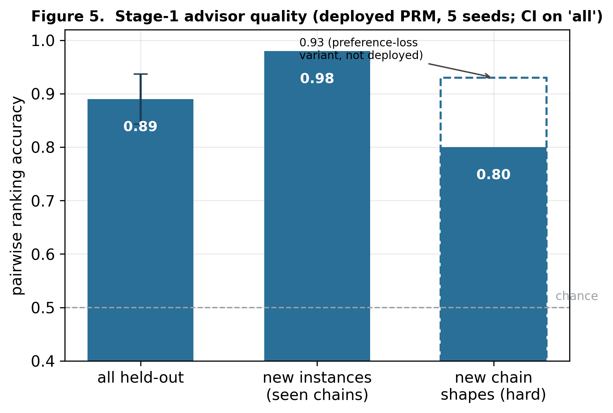
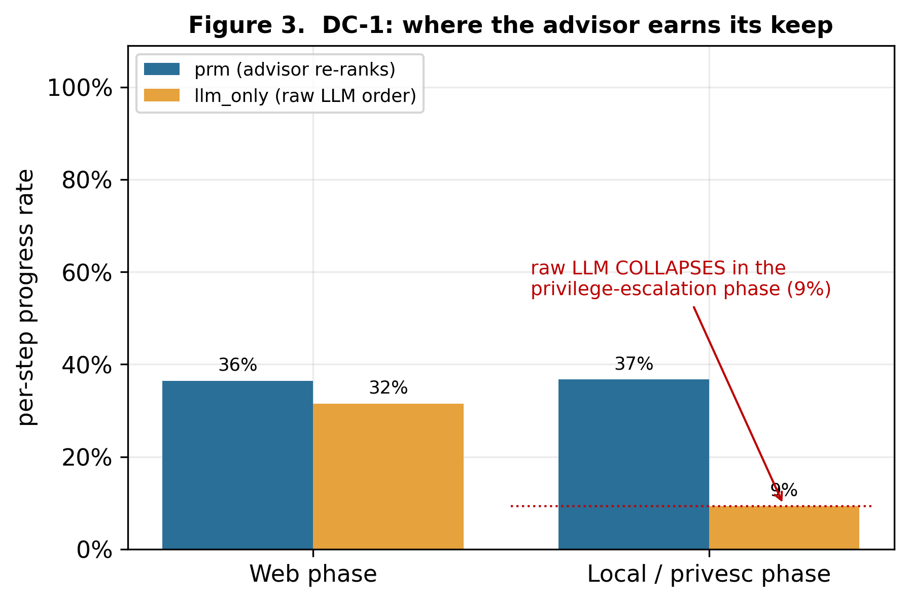
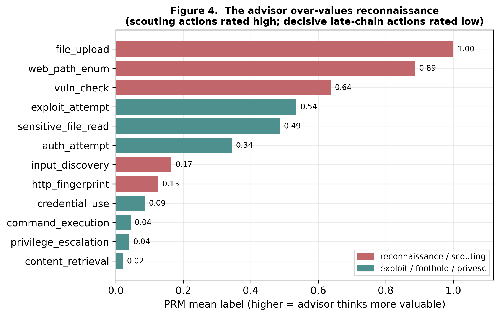
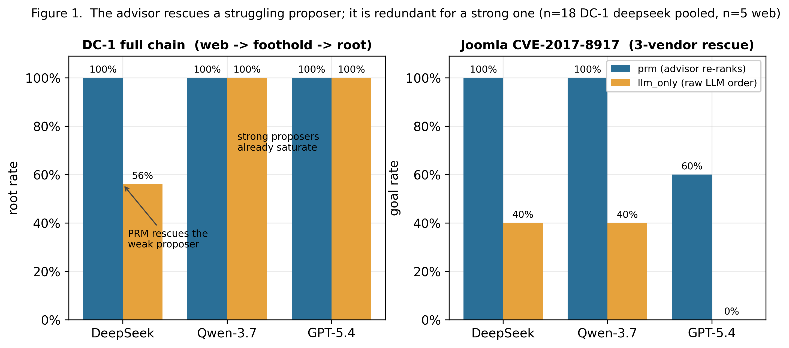
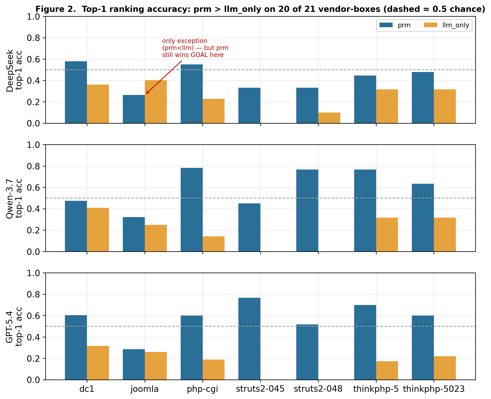

# 实验

## E.1 用大白话讲清楚:我们在测什么

**目标。** 我们想让一个 AI 智能体自主攻击一台 Web 服务器——找到漏洞、拿到立足点(一个 shell)、再提权到 *root*——并且在这一路上**帮**它选出更好的动作。

**思路。** 大语言模型(LLM,如 GPT)能*提议*下一步动作,但常常顺序不好、白走步数。我们的贡献是一个低成本的**顾问**,它对 LLM 提议的动作做**重排**,把最有希望的那个放到最前面先试。关键之处——也是科学价值所在——在于这个顾问*怎么*训练出来的:**完全在一个低成本的抽象模拟器里**训练,**不用任何真实目标的标签**,**也不偷看答案**。然后我们检验:这个在模拟器里学出来的顾问,到**真实**机器上还能不能给出好建议。

> **把顾问想成一位棋类教练。** 它本身不下棋;给定棋手已经在考虑的几步候选,它排出哪一步最有希望。我们这位教练只在一个简化的训练器里打过练习赛,从没碰过真正的比赛——所以问题就是:它的判断力能不能迁移过去。

我们把这个顾问叫做 **PRM**(*过程奖励模型*——它给每一*步*的好坏打分,而不是只看最终结果)。实验回答四个问题:

1. **模拟器真的能教出好判断力吗?**(E.3)
2. **这判断力能迁移到真实目标、并逐步地帮上忙吗?**(E.4)
3. **在它的辅助下,智能体能走通一次*完整*的真实攻击直到 root 吗?**(E.5)
4. **顾问在哪里会失灵,为什么?**(E.6)

E.7 汇总消融与对照;E.8 再问结论是否依赖于用哪个 LLM(答案是否定的);E.9 诚实报告唯一的局限。

**与创新点的对应。** 问题 1–2(E.3–E.4)为 **C1**(一个有用的逐步过程奖励评估器)与 **C2**(它是无标签获得的、且迁移成立)提供证据;问题 3(E.5)连同多 LLM 研究(E.8)是 **C3** 的证据(迁移来的信号驱动完整真实链到 root,且价值定位在提权阶段)。问题 4(E.6)与 E.9 **不是创新点**——它们是两条诚实的局限(高估侦察;proposer 条件性收益),完整报告。

## E.2 实验设置

**模拟器(顾问在哪训练)。** 我们没有在昂贵、标签稀缺的真实靶上训练,而是给单主机 Web 攻击建了一个*抽象*模型:一个简化世界,带一份**固定的 16 种动作菜单**(如"枚举路径""验证漏洞""执行命令""提权")。我们生成了 **65 个攻击任务**,覆盖 **12 种不同形状的攻击链**。划分时**留出 20 个任务做测试**,并且——很重要——其中 **10 个用的是顾问在训练中从未见过的攻击链形状**,这样我们测的是真正的泛化,而不是死记硬背。

在这个模拟器里,我们依次训练:一个强化学习的**价值 oracle**(它学会任意状态离目标有多近),它再为每个候选动作的好坏打**标签**,最后训练出 **PRM**(顾问)。有一条严格且承重的规则:**顾问永远只看得到可观测信息**——也就是攻击者真正能看到的东西;它*绝不*看 oracle 的内部分数,也*绝不*看隐藏答案。

**适配器(模拟器的建议怎么到真实目标)。** 三个小"翻译器"在模拟器和真实机器之间搭桥,外加一道安全检查:
- **读取器**:把真实工具的原始输出转成模拟器的状态格式;
- **解释器**:把 LLM 的自由文本动作("我来试试文件读取漏洞")映射到顾问能懂的 16 种固定动作之一;
- **执行器**:把选定的动作类型变成针对该具体目标的真实命令;
- **安全门**:对每条命令做白名单校验,确保智能体只能碰我们自己隔离实验室里的机器,且每条命令都留痕。

**目标靶。** **16 个真实的"Docker"Web 靶**(每个是一项带真实已知漏洞的 Web 服务——ThinkPHP、Struts2、Joomla 等)提供广度;**2 台完整虚拟机**(DC-1 与 Toppo)提供深度:即*完整*的链 *Web 入口 → 立足点 → 同机提权 → root*,这是单服务靶给不了的(表 1)。

**表 1 —— 真实目标靶:全部 16 个 Docker Web 靶(仅立足点),按立足点机制分组,+ 2 台整机 VM。**

| 立足点机制 | 数量 | Docker 靶(产品 / CVE) |
|---|---|---|
| 直接 RCE | 9 | ThinkPHP-5、ThinkPHP-5.0.23、Struts2 S2-045、Struts2 S2-048、php-cgi (CVE-2012-1823)、Drupal/Drupalgeddon2 (CVE-2018-7600)、Apache httpd (CVE-2021-41773)、Tomcat (CVE-2017-12615)、Gitea 1.4 |
| 弱口令 → 部署/RCE | 2 | Tomcat8(manager)、WebLogic |
| SQL 注入 | 1 | Joomla (CVE-2017-8917) |
| 模板注入(SSTI) | 1 | Flask / Jinja2 |
| 文件泄露 / LFI | 2 | Rails (CVE-2019-5418)、php-inclusion |
| 配置缺陷 / 路径穿越 | 1 | nginx(错误配置) |

全部 16 个 Docker 靶共享同一阶段(Web 入口 → 立足点)与终止指标(达到目标 = shell + 敏感读取)。2 台整机 VM 提供深度:

| 整机 VM(全机、→ root) | 链 | 终止指标 |
|---|---|---|
| **DC-1** | Drupalgeddon2 (CVE-2018-7600) → SUID `find` | `reached_root` |
| **Toppo** | `/admin/notes.txt` 中的凭据 → SSH → SUID `python` | `reached_root` |

*漏洞覆盖范围(诚实声明)。* 这 16 个靶横跨 ~12 个产品、6 类立足点机制,但**直接 RCE 居多(9/16)**——反映 Vulhub 语料分布。这是一次**产品广度**而非**漏洞类别广度**的评估。在本工作里这是方法上可接受的,因为冻结的 16 动作 schema 抽象的是 **kill-chain 的步骤**(侦察 → 定位 → 利用 → shell → 读取/提权),**而非漏洞类别**;所以 PRM 真正看到的逐靶多样性来自**链的长短与拓扑**(1 步自宣传 vs 多步),而非 CVE 家族。所有靶机均为自有、运行在隔离 host-only 网络、经白名单校验并留痕。(E.8 的多 LLM 研究使用其中 6 个靶的子集。)

**怎么衡量,以及公平对比。** 每个真实目标结果都是两个智能体的正面对决,二者用**同一个 LLM**,只差一点:
- **`prm`**:LLM 提议动作,顾问对其重排;
- **`llm_only`**:直接用 LLM 自己的排序,没有顾问。

所以任何差异都只能归因于顾问本身。`llm_only` 是**主基线**(同一个 LLM 智能体、不带顾问);在能让结论更锋利的地方,我们再加两个参照:一个**随机重排**对照(把同样的候选随机打乱顺序——用来分离"是顾问*特定*的排序起作用,还是仅仅重排就有用")和一个**脚本式、非 LLM** 的上界(在完全去掉 proposer 时确认目标本身可解)。我们报告三个指标,均为越高越好:
- **goal-rate / root-rate(↑)**——真正到达目标 / 拿到 root 的尝试占比(含义明确、无法作弊);
- **逐步进展率(↑)**——有多少*步*真正向前推进,而不是白走;
- **top-1 排序准确率(↑)**——顾问排在第一的动作有多少次确实是最好的那个。

由于一次运行是一串相关联的步骤(不是独立的抛硬币),朴素统计会高估显著性。我们采用 **episode 聚类置换检验**和**自助置信区间**,把两个智能体在相同处境上**配对**(公共随机数),并施加**多重比较校正**。全文报告的都是这些保守数字。

## E.3 问题一——模拟器能教出好判断力吗?

**一句话:能——顾问学到了"哪个动作能推进"的真实(虽不算强)感觉,而且全程没有泄漏。** 三方面证据:

**(a) 它对"进展"排序正确。** 我们把价值 oracle 与模拟器的*数学最优*解(用价值迭代算出)对比。它的单个最佳猜测只有 **32% 的时候**与最优一致——不算高——但最优动作有 **94% 的时候落在它的前 3 名里**,且它的整体排序与最优的**排序相关性为 +0.46**(0 表示随机,1 表示完美)。所以这个价值是一个真实但*粗糙*的进展信号:不精准,但能可靠地把好动作留在靠前的位置——而这正是一个*重排器*所需要的(它只需缩短候选清单,自己不必是 oracle)。

**(b) 顾问本身是个好排序器。** 评价排序器的标准指标是**成对准确率**:给定两个动作、且我们知道哪个更好,顾问有多少次排对?(0.5 是抛硬币,1.0 是完美。)我们**实际部署**的顾问在**全部留出任务上达到 0.89**(95% 置信区间 [0.84, 0.94],跨 5 个训练种子稳定)、在**训练过的攻击链的新实例上达到 0.98**、并且——最苛刻的测试——在**完全*没见过*的全新攻击链形状上是 0.80**:仍明显高于 0.5 抛硬币,但这一档是它最弱的地方。(一个带偏好损失的训练变体能把这个"新链"数字提到 0.93,说明还有尚未部署的提升空间。)顾问抓的是*处境*,而非死记某次攻击,这正是它在没见过的链形状上仍能高于随机排序的原因。全文报告的都是部署模型的数字,因为下面每个真实目标结果都是它驱动的。

**(c) 没有作弊。** 一次审计确认顾问的输入里**没有任何隐藏答案**——没有秘密路径、凭据或 flag——并且遮掉任意单个可观测字段都只让它*平缓*退化。它的本事来自可观测上下文,而非泄漏的秘密。

**表 2 —— Stage-1 顾问质量(部署模型)。** 留出集评估;PRM 成对准确率为 5 个种子上的结果。

| 检查项 | 数值 | 含义 |
|---|---|---|
| Oracle top-1 vs 最优 | 0.32 | 精准命中最佳动作只是中等 |
| Oracle top-3 vs 最优 | 0.94 | 最优动作几乎总在靠前位置 |
| Oracle 排序相关性 | +0.46 | 整体排序跟随最优 |
| PRM 成对——全部留出 | **0.89**(95% CI [0.84, 0.94]) | 正确排出两动作中更好的那个 |
| PRM 成对——新实例 | 0.98 | 泛化到训练链的新实例 |
| PRM 成对——**全新链形状** | **0.80** | 泛化到没见过的结构(最弱一档) |
| PRM 校准(ECE,sigmoid 后) | ≈ 0.08 | 预测分数校准良好 |

*图 5。部署顾问在各划分上的成对排序准确率(虚线 = 0.5 随机;"全部留出"柱上标了置信区间;虚线轮廓标出一个未部署的偏好损失变体在最难一档达到的 0.93)。*

一条诚实的边界:顾问是**排序器,不是棋手**。若让它完全独立驱动智能体,它作为独立策略并不成功——它的价值在于*出谋划策*,而这正是我们使用它的方式。

## E.4 问题二——建议能迁移到真实目标吗?

**一句话:能——在真实机器上,让顾问重排 LLM 的动作,带来了统计显著的逐步决策质量提升。** 首先,适配器是好用的:解释器把 LLM 的自由文本映射到正确动作类型,在一个有标注的基准上准确率为 **95.5%**,在更难的留出夹具上为 **78.5%**——相比未增强基线的 **49%** 有明显提升。然后,在 16 个真实 Web 靶上,`prm` 智能体在 **51.7% 的步上向前推进,而 `llm_only` 为 34.3%——领先 +17 个百分点**,且在保守的聚类统计下显著:**p = 0.0001**(多重比较校正后仍显著)。说白了:一个在低成本模拟器里、用零真实标签学到的排序感觉,可测量地改进了真实的逐步动作选择。(整局达标率也更高——prm 33% vs `llm_only` 7%——但这个增益**集中在 proposer 彻底失败的 box**(如 SSTI、Joomla);在两臂都能解的 box 上则打平。这个*proposer 条件性*模式在 E.5、E.9 详述。)

## E.5 问题三——能走通一次*完整*的真实攻击到 root 吗?

**一句话:能——而且顾问的帮助恰好集中在最难的提权阶段。** 在 **DC-1** 虚拟机上,智能体必须走完整条链:从 Web 应用打进去、拿到 shell、再在同一台机器上提权到 root。合并我们的运行(每个智能体 18 次尝试):
- **有顾问(`prm`):18/18 次拿到 root(100%)**;
- **没顾问(`llm_only`):10/18(56%)**——而且大约多用一倍步数。

关于噪声的诚实说明:LLM 在 DC-1 上的单独 root 率在不同批次间有波动(一批 40%,另一批 75%),而有顾问的智能体**两批都是 100%**。因此我们报告合并后的 56%,而非那次走运的抽样——诚实的解读是:**顾问在这里的价值是"可靠性"**:它*每次*都拿到 root,而原始 LLM 是抛硬币。

顾问*为什么*在整机上有用、在单服务靶上却只打平?把 DC-1 按阶段拆开就清楚了:有顾问的智能体在 **Web 阶段和提权阶段都**稳步推进,而没顾问的 LLM **恰恰在提权阶段崩塌(进展 9%)**,Web 侦察却仍做得不错。**顾问的价值正落在 LLM 自身直觉最弱的地方——本地提权——而这只有整机目标才能考到**(图 3)。

*图 3。DC-1 按阶段拆分的逐步进展率。两个智能体在 Web 阶段进展相近;原始 LLM 在提权阶段崩塌到 9%,而顾问维持在 37%。(顾问在 DC-1 的结果也见图 1 左面板。)*

第二台虚机 **Toppo** 划出一条干净的边界:*两个*智能体自主都失败,因为 LLM 连"找凭据 → SSH 登入"这一步都从未提议——然而一个脚本式(非 LLM)智能体在两台机器上都拿到了 root。所以适配器和顾问都是健全的;失败是 *LLM 想象力的边界*(它无法对一个自己从未提议的动作排序),而不是迁移坏了。

**表 3 —— 整机结果(自主、打到 root)。**

| VM | 智能体 | root 率 ↑ | 步数(中位) ↓ | 备注 |
|---|---|---|---|---|
| DC-1 | **prm** | **100%(18/18)** | ~6 | 每次都被顾问带到 root |
| DC-1 | llm_only | 56%(10/18) | ~12 | 批次间在 40–75% 波动 |
| Toppo | 两臂 | 0% | — | LLM 从不提议"凭据→SSH"这一步 |
| Toppo | 脚本式(非 LLM) | 100% | 1 | 证明适配器/顾问本身健全 |

## E.6 问题四——顾问在哪里失灵,为什么?

**一句话:顾问系统性地高估了侦察——这个偏差我们追溯到训练分布,并证明常见的后处理修法去不掉;我们把它作为*本套*迁移方案的诚实局限来报告,并对"声称什么、不声称什么"格外克制。** 在模拟器里,训练很少制造"已经什么都知道了却还在四处侦察"的情形;结果顾问就学成了"侦察几乎总是有价值"。具体地,它给"枚举 Web 路径"这一动作的平均分是 **0.89**,远高于"执行漏洞利用"的 **0.54**(图 4)。在真实目标上,这表现为顾问添加了能干的 LLM 并不需要的侦察步。

*图 4。顾问对各动作类型的平均打分。侦察/踩点类动作(红)被打得远高于真正推进攻击的决定性后段动作——执行命令(0.04)、提权(0.04)——这正是我们追溯到模拟器训练分布的"高估侦察"。*

要紧的是:它抵抗修复。我们尝试了**三种独立修法**——推理时给侦察降权、重新标注训练数据、在有更好动作时禁止侦察——**三种全部失败**,无法在不损伤顾问别处表现的前提下消除这个偏差。多种子检查进一步显示这个偏差的大小在不同训练种子间本身就不稳定。我们对边界格外克制:我们证明了**三种常见的后处理修法失败**,但**不**声称这个偏差**无法靠不同的训练/模拟器设计规避**,也**不**声称别的 LLM-渗透系统一定中招。因此我们把它作为**本套迁移方案的一个被刻画清楚的局限**来报告——最自然的解读是**训练期动作掩码诱发的协变量偏移下的奖励模型过优化** [gao2023scaling]——并把"这个偏差究竟是 sim→real 无标签迁移的内在属性,还是可被设计规避"留作**明确的开放问题**(一个受控的"不同设计"对照实验即可定论)。这是诚实的分析,不是 headline 结果。

## E.7 消融与对照

**一句话:这个增益经得起我们能想到的每一个对照——它不是泄漏、不是随便重排、也不是某个 proposer 的偶然。** 表 6 的每一行都隔离了一个挑剔审稿人可能提出的替代解释,并报告我们的发现。

**表 6 —— 消融与对照。**

| 对照 / 消融 | 要排除的替代解释 | 结果 |
|---|---|---|
| `llm_only`(去掉顾问) | 重排根本没用 | 逐步进展下降;顾问 − 基线显著,**p = 0.0001**(§E.4) |
| 随机重排(把候选随机打乱) | *任意*重排都有用,而非这个顾问的排序 | 顾问的优势是**阶段特异的**——它在提权阶段领先,但在简单的 web 步上并不稳定地高于随机(§E.5、§E.9) |
| 无泄漏输入审计 | 顾问读到了隐藏答案 | 输入里没有秘密路径 / 凭据 / flag;遮掉字段时平缓退化(§E.3c) |
| 通用提示对照 | 成功来自 CVE 命名提示(测试集泄漏) | 换成通用提示后,CVE 命名带来的提升消失;我们报告无泄漏的数字(§E.9) |
| 独立排序器(无 proposer) | 顾问其实是个策略 | 它无法独自驱动智能体——其价值严格是"出谋划策"(§E.3) |
| 三种去偏修复 | 侦察偏差是个可打补丁的 bug | 三种全部失败,且不损伤顾问别处(§E.6) |

承重的对照是第二行:正因为顾问的逐步优势**并非**一致地高于随机重排,我们才**刻意不**宣称一个笼统的逐步胜利——我们宣称的是一个*阶段*与*proposer 条件*的胜利,这由整机(§E.5)与多 LLM(§E.8)结果精确刻画。

## E.8 结论依赖于用哪个 LLM 吗?

**一句话:不依赖——我们用三个不同的 LLM 把整套对比重跑了一遍,每次都出现同样的行为。** 我们在完全相同的条件下(同样 7 个目标、同一份代码)测了 **DeepSeek、Qwen、GPT-5.4**。一条规则解释全部三家:

- **顾问救起吃力的 LLM,对强 LLM 则多余。** 在 Joomla 靶上,每个 LLM 单干都吃力,顾问把**三家**的成功率都拉了上来(例如 DeepSeek 和 Qwen 从 40% 到 100%,GPT-5.4 从 0% 到 60%)。在 DC-1 上,较弱的 DeepSeek 被救起(100% 对 56%),而 Qwen 和 GPT 自己就能解,顾问就带不来*结果*上的提升——本来就没什么可补的了。
- **顾问的排序几乎处处更好。** 它排第一的动作在 **21 个"目标×LLM"组合里有 20 个**优于原始 LLM。唯一的例外是一个测量伪影(在那个靶上,有顾问的智能体在真实目标上仍以 100% 对 40% 胜出)。
- **逐步效果取决于目标链的长短。** 顾问在较长的多步链上帮忙,但在平凡的一步式利用上略有*拖累*——那里 LLM 每步已直接打出唯一正确动作,多余的侦察只会稀释进展率。

图 1 展示第一点,图 2 展示第二点。支撑数据如下:

*图 1。顾问救起吃力的 proposer(DC-1 上的 DeepSeek;Joomla 上的三家),对一个已经能成功的 proposer 则多余(DC-1 上的 Qwen/GPT)。*

**表 4 —— Joomla goal 率(三厂商救场),每臂 n = 5。** 三家方向一致;每条腿都是小样本,所以看的是跨厂商的一致性,而非单条腿的显著性。

| 厂商 | llm_only goal ↑ | prm goal ↑ |
|---|---|---|
| DeepSeek | 0.40 | **1.00** |
| Qwen-3.7-max | 0.40 | **1.00** |
| GPT-5.4 | 0.00 | **0.60** |

**表 5 —— DC-1 轴(救场是 proposer-conditional 的)。**

| 厂商 | 每臂 n | llm_only root ↑ | prm root ↑ | 效果 |
|---|---|---|---|---|
| DeepSeek | 18(池化) | 0.56 | **1.00** | 救场(Δ +44 个百分点) |
| Qwen-3.7-max | 8 | 1.00 | 1.00 | 饱和(无余量) |
| GPT-5.4 | 8 | 1.00 | 1.00 | 饱和(无余量) |

*图 2。top-1 排序准确率,prm 对 llm_only,横跨 7 个目标 × 3 家厂商。顾问的首选在 21 个组合里有 20 个胜过原始 LLM(虚线 = 0.5 随机);唯一例外 DeepSeek-Joomla 是测量伪影(那盘顾问在真实目标上仍以 100% 对 40% 胜出)。*

所以:结果上的帮助是*有条件的*(LLM 弱时才出现),排序上的帮助*近乎普适*,逐步效果随攻击长短而变——同一个一致的机制,横跨三家厂商,**不限于任何单一模型。**

## E.9 唯一一条诚实的局限

我们明确陈述——并选择*不*以之为论文核心——以下这点:顾问对*最终结果*的好处,取决于 LLM 自己的排序本来有多好。它明显帮到弱的或没被"调教"过的 LLM(逐步 **+17 个百分点**,p = 0.0001)。但一旦我们用一个关于动作词表的明确提示去*调教* LLM,proposer 自己就变好了——它的 goal 率从 **0.16 升到 0.53**、白走步率从 **0.52 降到 0.32**——而在一个只考*排序*的隔离测试里,顾问的逐步进展(**0.27**)并不优于把同样候选随机重排(**0.29**)。一个称职的 proposer 留给重排器可补的空间就很小了。我们完整报告这个倒置,而非把它藏起来。我们不以之为核心,因为 (a) 那里"被调教"的 LLM 用了作者提供的提示,这会混淆对比;(b) 它是验证器 / 过程奖励模型文献中已知现象的一个具体案例 [lightman2023verify; cobbe2021gsm8k]——一个负责*检查*的模型,被一个不再犯错的生成器架空。

## E.10 小结

低成本的抽象模拟器产出了一种真实、无泄漏的"哪个动作能推进"的感觉(E.3);这种感觉**迁移**到真实机器并显著改进逐步选择(E.4);它**驱动完整的真实攻击直到 root**,价值恰好兑现在最难的提权阶段(DC-1:100% 对 56%;E.5);它有一个**被清楚刻画的失灵模式**——高估侦察,且抵抗三种修复(E.6);整幅图景在**三个不同 LLM 上复现**,由一条简单规则统辖(E.8)。顾问对最终成败的影响*取决于* LLM 是否弱,这一点我们作为局限诚实报告(E.9)。

## 参考文献

- **[gao2023scaling]** Gao, L., Schulman, J., Hilton, J. *Scaling Laws for Reward Model Overoptimization.*
  ICML 2023. —— 对应 E.6(把高估侦察刻画为分布偏移下的奖励模型过优化)。
- **[lightman2023verify]** Lightman, H., Kosaraju, V., Burda, Y., 等. *Let's Verify Step by Step.* 2023. ——
  对应 E.8(过程/步级验证器;验证器与生成器的关系)。
- **[cobbe2021gsm8k]** Cobbe, K., Kosaraju, V., Bavarian, M., 等. *Training Verifiers to Solve Math Word
  Problems.* 2021. —— 对应 E.8(验证器价值相对生成器强弱而变)。

*(bibkey 按常见命名习惯给出,投稿前请用你的文献管理器核对确切 key 与年份。)*
